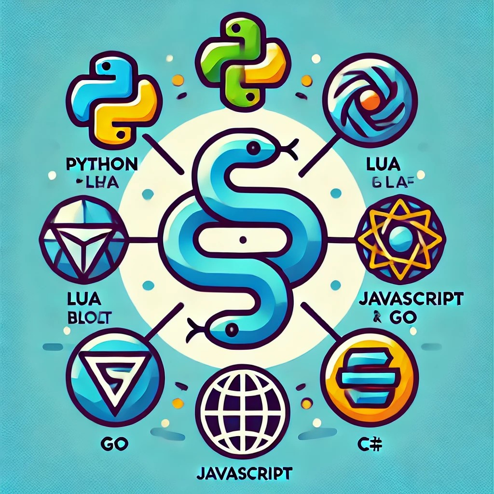

# 🚀 dmcpp-port 项目

.

**简体中文** · [English](./README.md) 

---

## 项目前言

在 C++ 与其他语言的互操作领域，开发者经常面临复杂的工具链和繁琐的配置流程。**dmcpp-port** 项目正是为了解决这些问题而诞生的，目标是为 C++ 开发者提供一个简洁、高效且统一的语言互操作解决方案。

---

## 项目介绍

在编程世界中，C++ 如同一条伟大的航路，强大而充满挑战，而其他编程语言则如同分散的四个大陆，各具特色却难以互通。**dmcpp-port** 项目，正如《海贼王》中的 **All Blue**，致力于打破语言的壁垒，架起一座桥梁，让开发者能够自由穿梭于不同的编程世界。

就像路飞寻找 **One Piece**，我们相信：
- 🐍 **Python** 的优雅如同东海，温柔而生机勃勃
- 🌿 **Lua** 的轻巧如同南海，灵活且充满可能性
- 🌐 **JavaScript** 的活力如同西海，无处不在
- ⚡ **Go** 的高效如同北海，冷峻且强大
- 🛡 **C#** 的全面如同红土大陆，坚实可靠

让我们共同开启这段伟大的航程，创造属于所有开发者的 **All Blue**！

---

## 移植状态

| 语言            | 状态   | 进度  | 备注                                   |
|-----------------|--------|-------|----------------------------------------|
| 🐍 Python      | 已实现 | 100%  | 使用 **pybind11** 完美实现，堪称典范      |
| 🌿 Lua         | 已实现 | 100%  | 使用 **sol2** 完美实现，堪称典范         |
| 🌐 JavaScript  | 已实现 | 100%  | 使用 **genepi API**，略显粗糙但可行      |
| 🌐 JavaScript  | 已实现 | 100%  | 使用 **emsdk** 实现，效果尚可           |
| ⚡ Go          | 未实现 | 20%   | 目前仅完成 demo                        |
| 🛡 C#          | 已实现 | 50%   | 完成 demo，代码生成器尚未实现            |

---

## 移植计划

### 🐍 Python
- **技术**：使用 **pybind11** 完成自动化绑定
- **项目名称**：`dmgen4pybind`

### 🌿 Lua
- **技术**：使用 **sol2** 完成自动化绑定
- **项目名称**：`dmgen4sol`

### 🌐 JavaScript
- **技术**：使用 **genepi** 完成自动化绑定
- **项目名称**：`dmgen4node`

### 🌐 JavaScript (WASM)
- **技术**：使用 **emsdk** 完成自动化绑定
- **项目名称**：`dmgen4wasm`

### ⚡ Go
- **技术**：使用 **swig** 完成自动化绑定
- **项目名称**：`dmgodemo`

### 🛡 C#
- **技术**：使用 **CppCsharp** 完成绑定
- **项目名称**：`dmcsharp-dmprojectinfo`

---

## 开发指南

1. 每个语言的移植将创建独立分支。
2. 移植完成后将合并到主分支。
3. 每个语言的移植需要包含单元测试。 ✅
4. 保证 API 接口的一致性。 ✅

---

## 贡献指南

欢迎贡献代码并提交 Pull Request，请遵循以下规范：
- 每个语言的移植创建独立目录。
- 保持代码风格的一致性。
- 提供完整的文档和测试用例。 📚

---

## 总结

**pybind11** 和 **sol2** 的实现堪称完美，比其他语言的解决方案更为优雅。尽管目前还有一些语言的移植工作在进行中，但我们相信这个项目将大大简化跨语言开发的复杂性，并为开发者带来更高效的工作方式。让我们一起迈向更加活跃、健康和充满创意的未来吧！ 🌟🚀

---

## 语言

[English](README.en.md)
---
